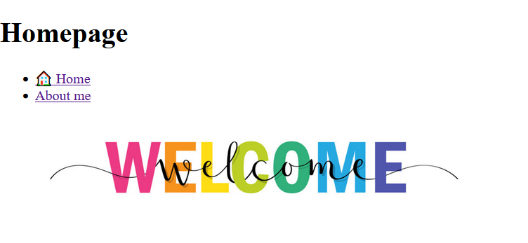

# Html Assignment

A first Assignment built with pure HTML only.

### Built with

- Semantic HTML5 markup

## Live Demo

https://visionary-trifle-b83c94.netlify.app/

## Optimizations / Future actions

Optimizing the app for performance and responsiveness is crucial for delivering a positive user experience.

## Screenshots

## Author

- Linkedin - [Elisabeth Erkekoglou ](https://www.linkedin.com/in/eerkekoglou/)
- Frontend Mentor - [@elic4vet](https://www.frontendmentor.io/profile/elic4vet)
- Instagram - [@elisa.codes23](https://www.instagram.com/elisa.codes23/)
